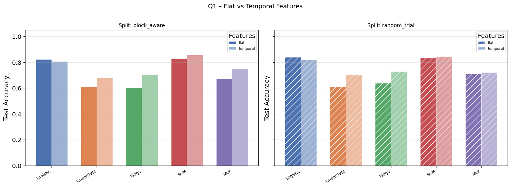
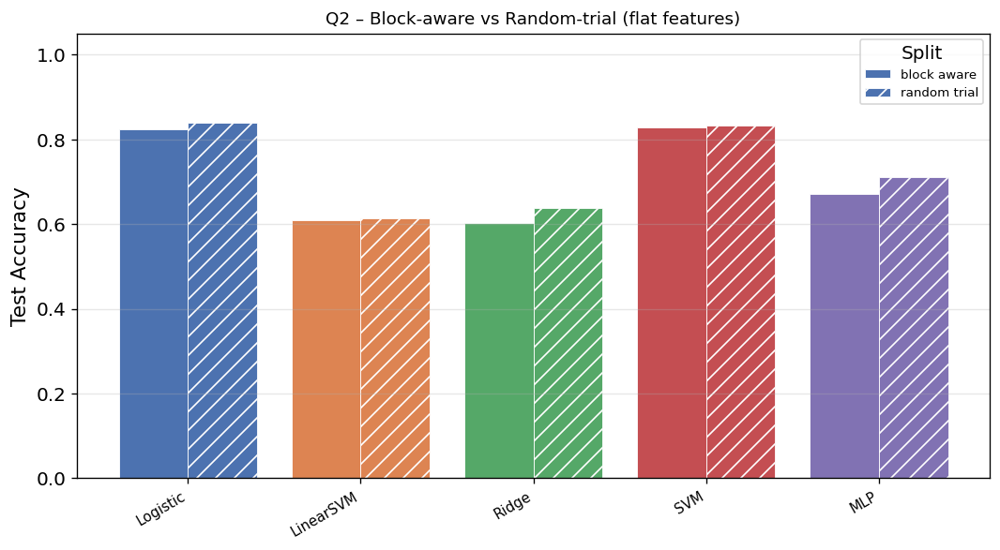
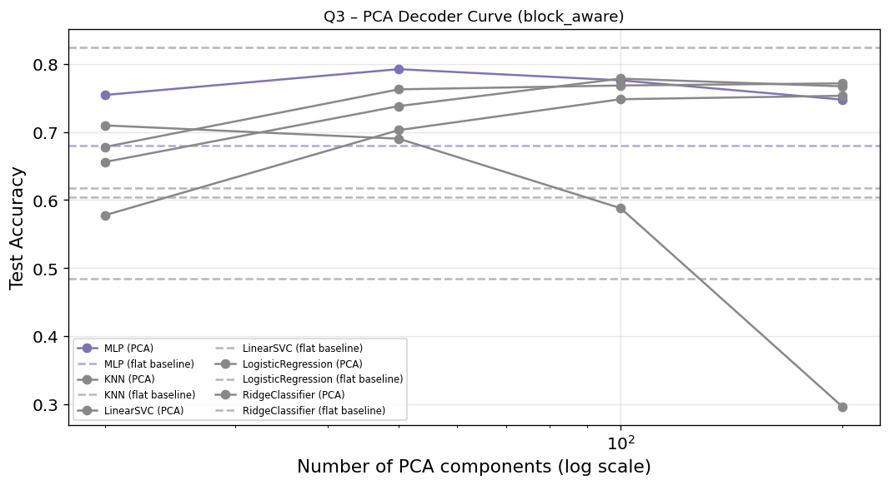
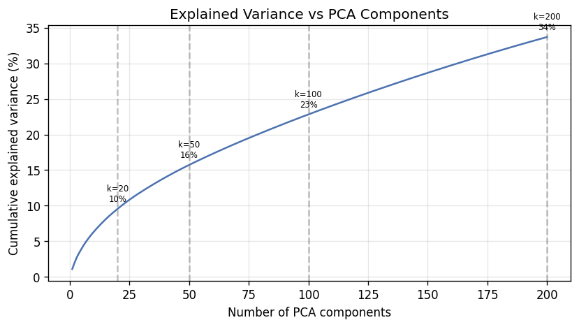
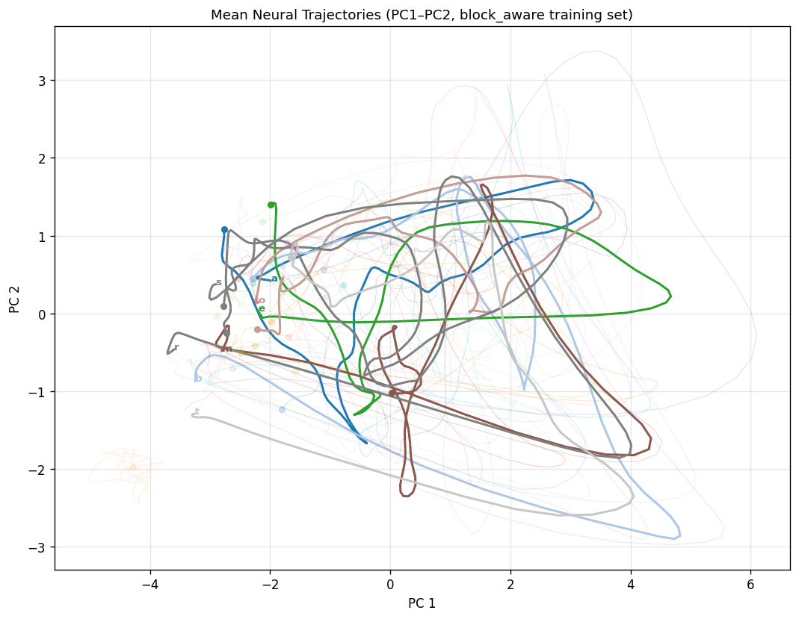
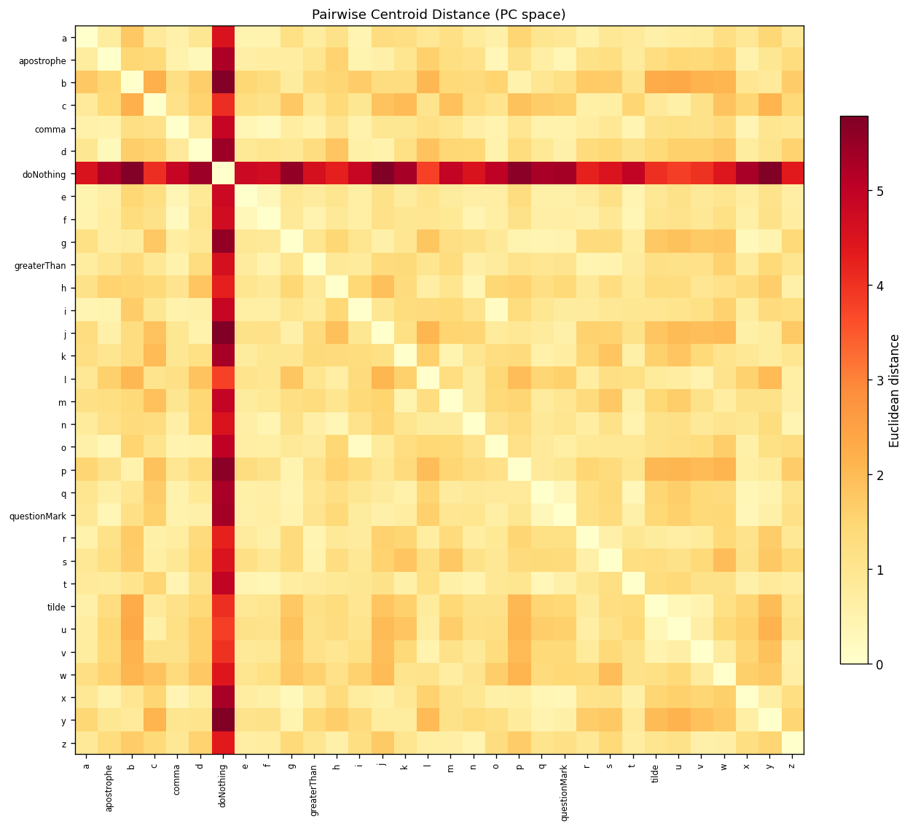

# Handwriting BCI – 3-Question Analysis Report

_Generated automatically by `08_make_figures_tables_report.py`_

## 1  Analysis Overview

This report investigates three methodological questions in single-character handwriting decoding from neural population activity (BrainGate T5 dataset).

**Q1 – Flat vs temporal features:**  Does fine-grained spatiotemporal structure matter, or do coarse temporal envelopes suffice?

**Q2 – Block-aware vs random-trial split:**  How robust is the decoder to neural drift and genuine temporal generalization?

**Q3 – No PCA vs PCA before classification:**  Does decoding require the full high-dimensional space, or can a reduced-dimensional latent representation preserve sufficient information?

## 2  Data and Preprocessing

### Dataset

- **Sessions:** t5.2019.05.08, t5.2019.11.25, t5.2019.12.09, t5.2019.12.11, t5.2019.12.18, t5.2019.12.20, t5.2020.01.06, t5.2020.01.08, t5.2020.01.13, t5.2020.01.15

- **Characters:** 31 classes (26 letters + 5 punctuation tokens)

- **Total trials:** 3627

- **Trial shape after preprocessing:** (100, 192)

### Preprocessing Steps

The preprocessing replicates the notebook's signal-conditioning philosophy:

1. **A2 – Block-mean subtraction:**  For each trial, the block-level mean activity (`meansPerBlock` from the MATLAB dataset) is subtracted channel-wise to remove slow baseline drifts within a recording block.

2. **A3 – Global channel normalization:**  Each channel is divided by the dataset-wide standard deviation (`stdAcrossAllData` from the MATLAB dataset), with ε = 1e-08 to prevent division by zero.  This equalises channel scales without fitting any statistic to the test set.

3. **A4 – Gaussian temporal smoothing:**  Gaussian smoothing is applied along the time axis only (σ = 20.0 ms → σ_bins = 2.0 bins at 10.0 ms/bin).  Channels are never mixed.

4. **A6 – Movement-window extraction:**  Only bins [51, 151) are kept, yielding T_fixed = 100 bins (~1000 ms of movement).

## 3  Split Definitions

| Split | Method | Description |
|-------|--------|-------------|
| `block_aware` | Chronological block hold-out | Last 25% of blocks per session → test; preceding 25% → val; remaining → train. Blocks never shared across sets. |
| `random_trial` | Stratified random | Trials randomly assigned to train/val/test with class stratification. Easier benchmark. |

## 4  Q1 – Flat vs Temporal Features

_Feature dimensions:_ flat = T×C = 19 200; temporal = 3×C = 576

_Temporal windows:_ early [0, 33), middle [33, 66), late [66, 100)

| model     | features   | split        |   test_accuracy |   test_macro_f1 |
|:----------|:-----------|:-------------|----------------:|----------------:|
| LinearSVM | flat       | block_aware  |        0.609741 |        0.598464 |
| LinearSVM | temporal   | block_aware  |        0.677419 |        0.671665 |
| Logistic  | flat       | block_aware  |        0.822897 |        0.81819  |
| Logistic  | temporal   | block_aware  |        0.805187 |        0.80134  |
| MLP       | flat       | block_aware  |        0.671727 |        0.668753 |
| MLP       | temporal   | block_aware  |        0.746996 |        0.743892 |
| Ridge     | flat       | block_aware  |        0.602783 |        0.598867 |
| Ridge     | temporal   | block_aware  |        0.703352 |        0.69517  |
| SVM       | flat       | block_aware  |        0.829222 |        0.825812 |
| SVM       | temporal   | block_aware  |        0.855787 |        0.85295  |
| LinearSVM | flat       | random_trial |        0.61301  |        0.601259 |
| LinearSVM | temporal   | random_trial |        0.703418 |        0.701696 |
| Logistic  | flat       | random_trial |        0.840132 |        0.838917 |
| Logistic  | temporal   | random_trial |        0.818082 |        0.81548  |
| MLP       | flat       | random_trial |        0.710033 |        0.706916 |
| MLP       | temporal   | random_trial |        0.722161 |        0.720462 |
| Ridge     | flat       | random_trial |        0.638368 |        0.634018 |
| Ridge     | temporal   | random_trial |        0.727674 |        0.724352 |
| SVM       | flat       | random_trial |        0.833517 |        0.834301 |
| SVM       | temporal   | random_trial |        0.844542 |        0.843566 |

## 5  Q2 – Block-aware vs Random-trial

_Feature:_ flat only (same feature set; split difficulty varies)

| model     | split        |   test_accuracy |   test_macro_f1 |
|:----------|:-------------|----------------:|----------------:|
| LinearSVM | block_aware  |        0.609741 |        0.598464 |
| LinearSVM | random_trial |        0.61301  |        0.601259 |
| Logistic  | block_aware  |        0.822897 |        0.81819  |
| Logistic  | random_trial |        0.840132 |        0.838917 |
| MLP       | block_aware  |        0.671727 |        0.668753 |
| MLP       | random_trial |        0.710033 |        0.706916 |
| Ridge     | block_aware  |        0.602783 |        0.598867 |
| Ridge     | random_trial |        0.638368 |        0.634018 |
| SVM       | block_aware  |        0.829222 |        0.825812 |
| SVM       | random_trial |        0.833517 |        0.834301 |

## 6  Q3 – No PCA vs PCA before Classification

_Split:_ block_aware (primary).  k ∈ {20, 50, 100, 200} components.

| model              | features   |   n_components |   test_accuracy |   test_macro_f1 |
|:-------------------|:-----------|---------------:|----------------:|----------------:|
| KNN                | flat_pca   |             20 |        0.709515 |        0.71163  |
| KNN                | flat_pca   |             50 |        0.689981 |        0.692829 |
| KNN                | flat_pca   |            100 |        0.587902 |        0.579247 |
| KNN                | flat_pca   |            200 |        0.296156 |        0.321277 |
| KNN                | flat       |            nan |        0.483932 |        0.505973 |
| LinearSVC          | flat_pca   |             20 |        0.655955 |        0.664694 |
| LinearSVC          | flat_pca   |             50 |        0.73787  |        0.735856 |
| LinearSVC          | flat_pca   |            100 |        0.778198 |        0.768639 |
| LinearSVC          | flat_pca   |            200 |        0.766856 |        0.760048 |
| LinearSVC          | flat       |            nan |        0.617517 |        0.611616 |
| LogisticRegression | flat_pca   |             20 |        0.678009 |        0.677921 |
| LogisticRegression | flat_pca   |             50 |        0.762445 |        0.760927 |
| LogisticRegression | flat_pca   |            100 |        0.768116 |        0.763223 |
| LogisticRegression | flat_pca   |            200 |        0.771267 |        0.761412 |
| LogisticRegression | flat       |            nan |        0.824197 |        0.817238 |
| MLP                | flat_pca   |             20 |        0.754253 |        0.754631 |
| MLP                | flat_pca   |             50 |        0.79206  |        0.793029 |
| MLP                | flat_pca   |            100 |        0.775677 |        0.772462 |
| MLP                | flat_pca   |            200 |        0.747322 |        0.744267 |
| MLP                | flat       |            nan |        0.679899 |        0.67316  |
| RidgeClassifier    | flat_pca   |             20 |        0.57782  |        0.554384 |
| RidgeClassifier    | flat_pca   |             50 |        0.702583 |        0.689808 |
| RidgeClassifier    | flat_pca   |            100 |        0.747952 |        0.732211 |
| RidgeClassifier    | flat_pca   |            200 |        0.752993 |        0.735955 |
| RidgeClassifier    | flat       |            nan |        0.603655 |        0.599136 |

### Explained Variance

|   n_components |   cumulative_variance |
|---------------:|----------------------:|
|             20 |             0.0955081 |
|             50 |             0.156685  |
|            100 |             0.227444  |
|            200 |             0.336848  |

## 7  PCA Trajectory Analysis

Neural trajectories in PC1–PC2 space during the movement window.

Each curve represents the mean population trajectory for one character.

## 8  Main Conclusions

- **Q1:** Flat and temporal features achieve similar performance (-0.050 accuracy difference), suggesting coarse temporal windows may capture most of the discriminative information.

- **Q2:** Random-trial split exceeds block-aware by 0.020 accuracy on average, confirming that neural drift makes temporal generalization substantially harder than within-distribution decoding.

- **Q3:** PCA(200) vs raw flat: +0.025 accuracy average.  PCA provides a regularization benefit.

## 9  Limitations

- Single participant (T5); generalisability to other participants is unknown.

- Block-aware test fraction is fixed (25%); other fractions may give different generalisation gaps.

- MLP and SVM grids are coarse; more exhaustive tuning might improve performance.

- PCA for classification is applied to flattened features; channel-space PCA (used for trajectories) is a conceptually different compression.

- Temporal window boundaries (early/mid/late) are equal-width; task-adapted windows might better capture the writing dynamics.
